# TaskAI 用户流程图

## 🗺️ 用户旅程总览

TaskAI的用户旅程围绕语音输入创建任务展开，通过简洁直观的设计，让用户能够快速高效地管理待办事项。

## 🎯 核心用户流程

### 主要流程：语音创建任务

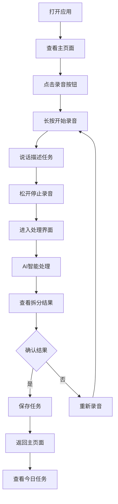

### 备用流程：手动任务管理

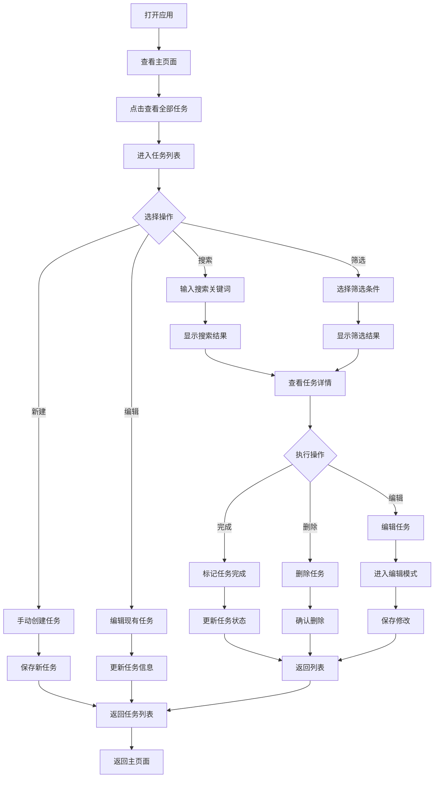

## 📱 详细页面流程

### 主页面流程

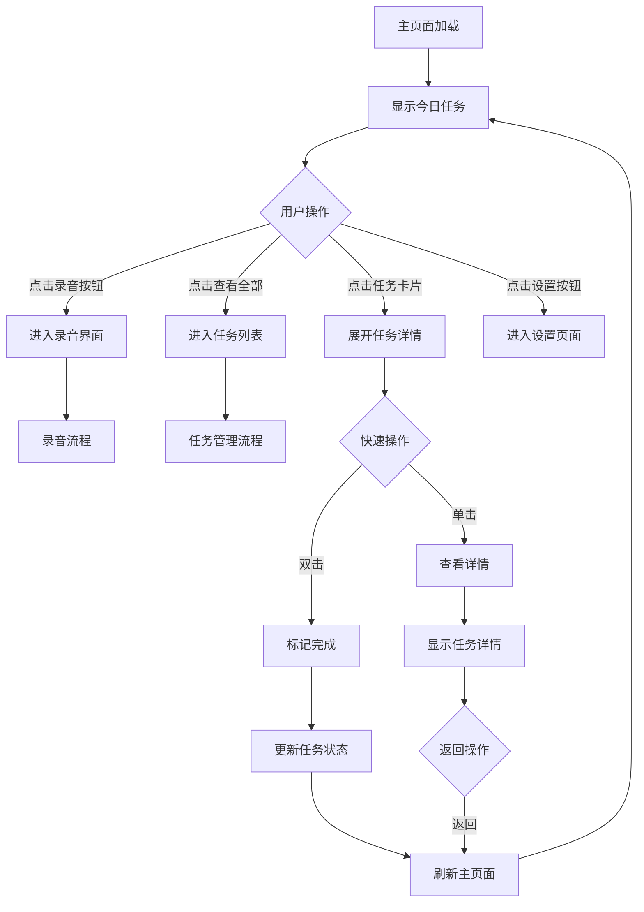

### 录音界面流程

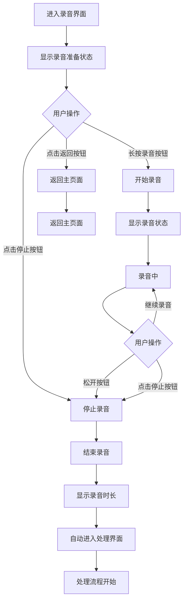

### 处理界面流程

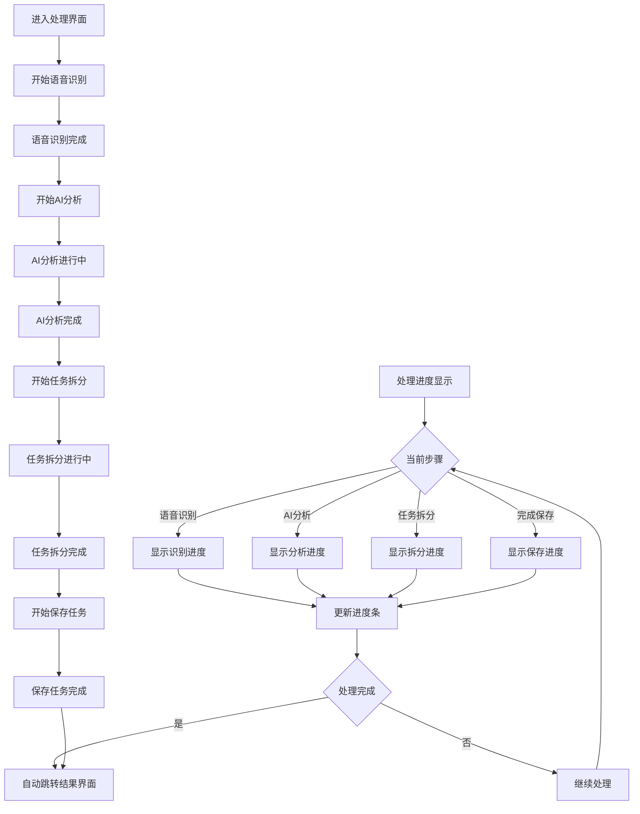

### 结果界面流程

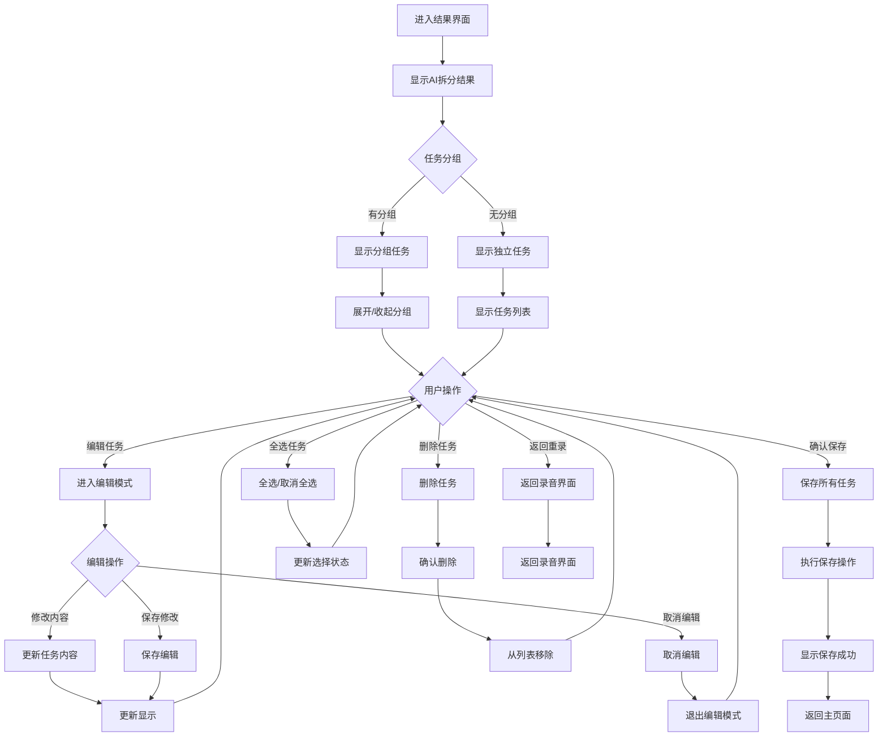

### 任务列表流程

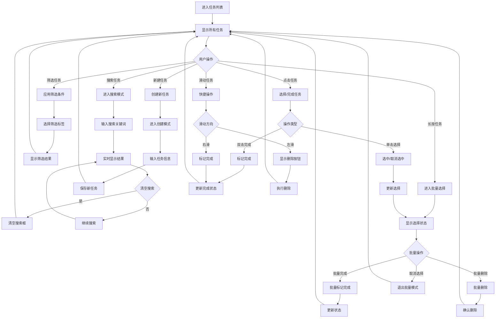

### 设置页面流程

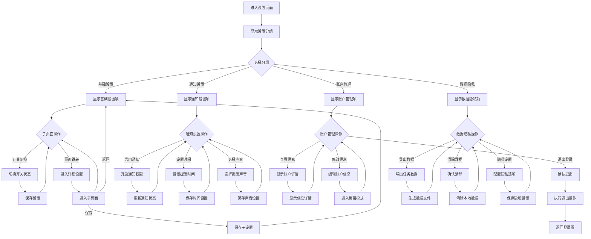

## 🔄 异常流程处理

### 网络异常流程

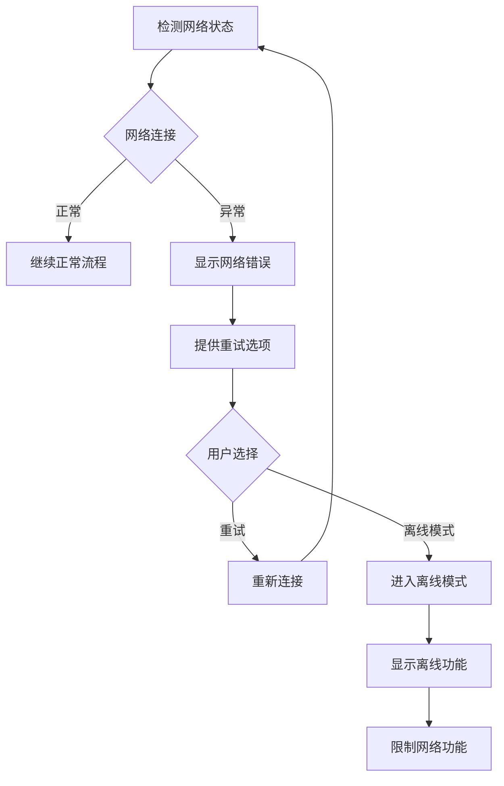

### 录音异常流程

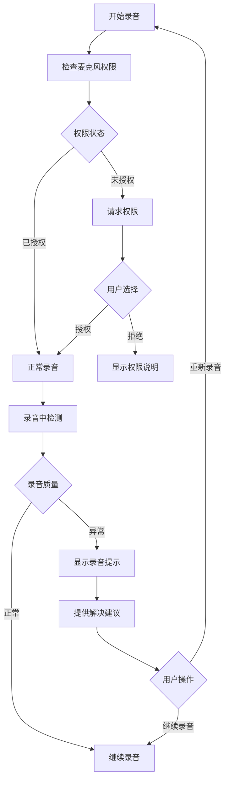

### 数据保存异常流程

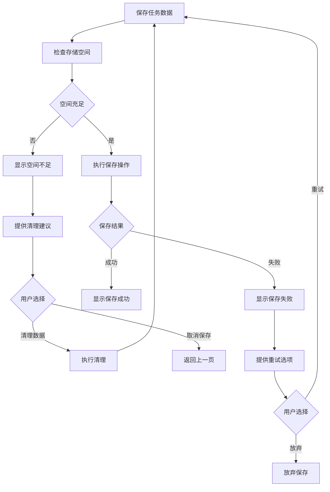

## 📊 用户体验指标

### 关键性能指标 (KPI)
- **任务创建时间**：< 10秒（从录音到保存）
- **页面加载时间**：< 2秒
- **交互响应时间**：< 200ms
- **语音识别准确率**：> 95%

### 用户满意度指标
- **学习成本**：5分钟内上手
- **操作效率**：核心功能3步内完成
- **错误恢复**：支持误操作恢复
- **视觉舒适度**：减少视觉疲劳

## 🎯 用户流程优化

### 流程简化
1. **减少步骤**：核心功能最多3步完成
2. **智能默认**：提供智能默认选项
3. **快捷操作**：支持手势和快捷键
4. **批量处理**：支持批量操作

### 反馈优化
1. **即时反馈**：操作后立即反馈
2. **进度显示**：长时间操作显示进度
3. **状态指示**：清晰的系统状态指示
4. **错误提示**：友好的错误信息

### 个性化定制
1. **偏好设置**：记住用户偏好
2. **智能推荐**：基于使用习惯推荐
3. **快捷方式**：自定义快捷操作
4. **主题定制**：支持主题切换

---

**文档版本：** 1.0
**最后更新：** 2024年11月
**负责人：** 设计团队
**审核状态：** 已完成

这份用户流程图为TaskAI应用提供了完整的用户旅程设计，确保用户体验的流畅性和一致性。