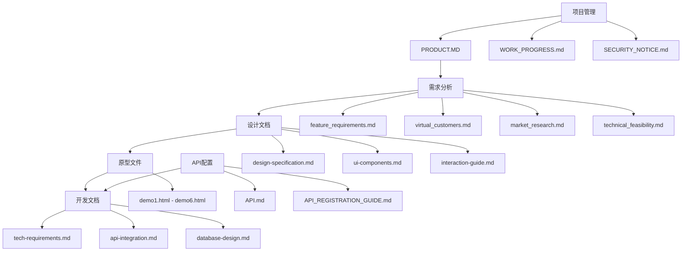

# TaskAI 项目结构总览

## 📁 项目目录结构

```
TaskAI/
├── 📄 README.md                    # 项目主页说明
├── 📄 PRODUCT.MD                   # 产品开发流程文档
│
├── 📁 api/                         # API配置文档
│   ├── 📄 README.md                # API文档说明
│   ├── 📄 API.md                   # API密钥和配置 (⚠️ 敏感信息)
│   ├── 📄 API_REGISTRATION_COMPLETE_GUIDE.md  # 完整注册指南
│   ├── 📄 API_REGISTRATION_GUIDE.md # 基础注册指南
│   └── 📄 BAIDU_API_SETUP_GUIDE.md # 百度API设置指南
│
├── 📁 docs/                        # 项目文档
│   ├── 📁 01-requirements/         # 需求分析文档
│   │   ├── 📄 README.md            # 需求文档说明
│   │   ├── 📄 feature_requirements.md      # 功能需求文档
│   │   ├── 📄 virtual_customers.md         # 用户画像分析
│   │   ├── 📄 market_research.md           # 市场调研报告
│   │   └── 📄 technical_feasibility.md     # 技术可行性分析
│   │
│   ├── 📁 01-design/               # 设计文档
│   │   ├── 📄 README.md            # 设计文档总览
│   │   ├── 📄 design-specification.md     # UI设计规范
│   │   ├── 📄 ui-components.md            # UI组件库
│   │   ├── 📄 interaction-guide.md        # 交互设计指南
│   │   ├── 📄 FIGMA_PROTOTYPE_SPECIFICATION.md  # Figma原型规范
│   │   ├── 📄 GEMDESIGN_DIALOGUE_SCRIPT.md       # GemDesign对话脚本
│   │   ├── 📄 PROTOTYPE_DESIGN_GUIDE.md          # 原型设计指南
│   │   └── 📄 PROTOTYPE_DESIGN_PLAN.md           # 原型设计计划
│   │
│   ├── 📁 02-prototype/            # 原型文档
│   │   ├── 📄 README.md            # 原型文档总览
│   │   ├── 📄 prototype-summary.md # 原型设计总结
│   │   └── 📄 user-journey.md      # 用户流程图
│   │
│   ├── 📁 03-development/          # 开发文档
│   │   ├── 📄 README.md            # 开发文档总览 (待创建)
│   │   ├── 📄 api-integration.md   # API集成指南 (待创建)
│   │   ├── 📄 tech-requirements.md # 技术需求 (待创建)
│   │   ├── 📄 database-design.md   # 数据库设计 (待创建)
│   │   ├── 📄 TECH_VERIFICATION_REPORT.md  # 技术验证报告
│   │   └── 📄 tech_verification_plan.md     # 技术验证计划
│   │
│   └── 📁 04-management/           # 项目管理文档
│       ├── 📄 README.md            # 管理文档说明
│       ├── 📄 WORK_PROGRESS.md     # 工作进度记录
│       ├── 📄 DOCUMENTATION_INDEX.md      # 文档索引
│       └── 📄 SECURITY_NOTICE.md   # 安全使用指南
│
├── 📁 prototypes/                  # 原型文件
│   ├── 📁 01-homepage/             # 主页面原型
│   │   └── 📄 demo1.html
│   ├── 📁 02-recording/            # 录音界面原型
│   │   └── 📄 demo2.html
│   ├── 📁 03-processing/           # 处理界面原型
│   │   └── 📄 demo3.html
│   ├── 📁 04-result/               # 结果界面原型
│   │   └── 📄 demo4.html
│   ├── 📁 05-tasklist/             # 任务列表原型
│   │   └── 📄 demo5.html
│   └── 📁 06-settings/             # 设置页面原型
│       └── 📄 demo6.html
│
├── 📁 demo/                        # 演示文件
│   └── 📄 index.html               # Web演示页面
│
├── 📁 assets/                      # 静态资源 (待完善)
│   ├── 📁 images/                  # 图片资源
│   └── 📁 icons/                   # 图标资源
│
├── 📁 development/                 # 开发相关 (待完善)
├── 📁 src/                         # 源代码 (待创建)
│   ├── 📁 components/              # 组件
│   ├── 📁 pages/                   # 页面
│   ├── 📁 services/                # 服务
│   └── 📁 utils/                   # 工具函数
│
├── 📁 tests/                       # 测试文件 (待创建)
├── 📁 .git/                        # Git版本控制
├── 📁 .claude/                     # Claude配置
└── 📄 PROJECT_STRUCTURE.md         # 项目结构说明 (本文件)
```

## 📊 文件统计

### 文档分类统计
| 分类 | 文件数量 | 说明 |
|------|----------|------|
| 📋 需求分析 | 4个 | 市场、用户、需求、可行性 |
| 🎨 设计文档 | 8个 | UI设计、组件、交互、原型 |
| 🚀 开发文档 | 5个 | 技术、API、数据库、验证 |
| 📊 项目管理 | 3个 | 进度、文档、安全 |
| 🔧 API配置 | 5个 | 配置、注册、指南 |
| 🎯 原型文件 | 6个 | 6个核心页面原型 |
| 📦 其他 | 3个 | 演示、说明、结构 |

**总计**：34个文档文件 + 6个原型文件 = 40个文件

### 完成状态
- ✅ **需求分析**：100% 完成
- ✅ **设计文档**：100% 完成
- ✅ **原型文件**：100% 完成
- ✅ **API配置**：100% 完成
- ✅ **项目管理**：100% 完成
- 🚧 **开发文档**：60% 完成 (部分待创建)
- ⏳ **源代码**：0% 完成 (待开发)

## 🎯 文档命名规范

### 命名约定
- **英文文件名**：使用小写字母和下划线
- **中文文件名**：仅用于临时文件，正式文档使用英文
- **README文件**：每个目录都有README.md说明文件
- **编号前缀**：文档目录使用编号前缀便于排序

### 文件分类
- `01-*`：需求分析阶段文档
- `02-*`：设计阶段文档
- `03-*`：开发阶段文档
- `04-*`：管理相关文档

## 🔗 文档关系图



## 🎯 使用指南

### 新开发者入门
1. 阅读 `README.md` 了解项目概况
2. 查看 `PRODUCT.MD` 了解开发流程
3. 阅读 `docs/01-requirements/` 了解需求背景
4. 查看 `docs/01-design/` 了解设计规范
5. 参考 `prototypes/` 查看原型实现
6. 配置 `api/` 中的API密钥
7. 开始开发工作

### 文档维护
- 每个目录都有README.md说明文件
- 重要变更需要更新相关文档
- 定期检查文档的准确性和完整性
- 遵循命名规范和目录结构

### 安全注意事项
- `api/API.md` 包含敏感信息，请勿泄露
- 生产环境使用环境变量管理API密钥
- 定期更新安全相关配置

---

**文档版本**：1.0
**最后更新**：2024年11月
**维护状态**：持续更新
**项目状态**：第4步完成，第5步准备中